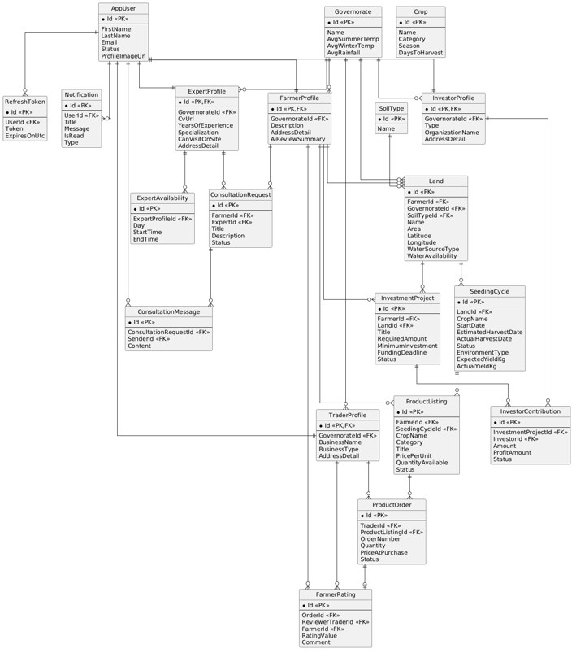

# 🌾 Namaa — Agricultural Backend Platform

     

---

# 📌 Overview

**Namaa** is a scalable backend platform that digitizes and connects the agricultural ecosystem, linking farmers, traders, investors, agricultural experts, and administrators through a unified API.

The platform supports:

- 🌱 Land Registration
- 🌾 Crop & Seeding Cycle Management
- 🛒 Marketplace Trading
- 💰 Agricultural Investment Opportunities
- 👨‍🌾 Farmer Management
- 👨‍⚕️ Expert Consultations
- 🌦️ Weather Insights
- 🤖 AI-Powered Agricultural Assistant

Rather than being a simple CRUD application, Namaa was designed using real backend engineering practices, including Clean Architecture, CQRS, centralized error handling, caching, and validation pipelines to keep the system maintainable and extensible.

---

# 📚 Table of Contents

- [📌 Overview](#-overview)
- [🎯 Project Goal](#-project-goal)
- [📊 Project Highlights](#-project-highlights)
- [🧱 Architecture](#-architecture)
- [🔄 Request Flow](#-request-flow)
- [🔁 Pipeline Behaviors](#-pipeline-behaviors)
- [⚡ Engineering Highlights](#-engineering-highlights)
- [🚀 Features](#-features)
  - [🔐 Security & Identity](#-security--identity)
  - [🌱 Agricultural Management](#-agricultural-management)
  - [🛒 Marketplace & Trading](#-marketplace--trading)
  - [💰 Investment Opportunities](#-investment-opportunities)
  - [🩺 Expert Consultation](#-expert-consultation)
  - [🤖 AI Assistant](#-ai-assistant)
  - [🔌 External Integrations](#-external-integrations)
- [👥 System Roles](#-system-roles)
- [💽 Database Design](#-database-design)
- [🧰 Tech Stack](#-tech-stack)
- [🔧 Configuration](#-configuration)
- [🚀 Getting Started](#-getting-started)
- [📄 API Documentation](#-api-documentation)
- [💻 My Contributions](#-my-contributions)
- [👥 Contributors](#-contributors)
- [📄 Copyright](#-copyright)

---

# 🎯 Project Goal

Namaa was developed as a graduation engineering project to explore how modern software engineering practices can be applied to build a scalable agricultural management platform.

The system brings together multiple stakeholders — including farmers, traders, investors, and agricultural experts — through a unified backend API that supports agricultural operations, marketplace activities, consultations, and investment opportunities.

Beyond the core business features, this project gave me the opportunity to design and build a real backend from the ground up — using Clean Architecture, CQRS, validation pipelines, centralized error handling, caching, and external service integrations.

---

# 📊 Project Highlights

- 🌐 ASP.NET Core 9
- 💻 C#
- 🐘 PostgreSQL
- 🗃️ Entity Framework Core 9
- 🏛️ Clean Architecture
- 🔀 CQRS + MediatR
- 🔐 JWT Authentication
- ✅ FluentValidation
- 📝 Serilog Logging
- 💾 HybridCache
- 🤖 OpenAI Integration
- 🌦️ OpenWeatherMap Integration
- ☁️ Cloudinary Integration
- 📧 MailKit + Brevo SMTP
- 📄 RFC 7807 Problem Details
- 🌍 Global Exception Handling
- ⚡ Performance Monitoring
- 🚨 Typed Error System

---

# 🧱 Architecture

Namaa follows **Clean Architecture** with a clear separation of concerns.

| Layer | Responsibilities |
|---|---|
| **Namaa.API** | Controllers, authentication, authorization, Swagger, exception handling |
| **Namaa.Application** | CQRS commands & queries, MediatR handlers, DTOs, validation, pipeline behaviors |
| **Namaa.Domain** | Entities, domain rules, enumerations, typed errors |
| **Namaa.Infrastructure** | EF Core, PostgreSQL, JWT, Cloudinary, OpenAI, weather API, email services, caching |

---

## 🔄 Request Flow

```text
Client
  ↓
API Controllers
  ↓
MediatR Pipeline
  ↓
Command / Query Handler
  ↓
Domain Logic
  ↓
Infrastructure
  ↓
Database / External Services
```

---

## 🔁 Pipeline Behaviors

```text
Unhandled Exception
  ↓
Performance Monitoring
  ↓
Active User Authorization
  ↓
Caching
  ↓
Validation
```

---

# ⚡ Engineering Highlights

### 🔀 CQRS + MediatR
Commands mutate state while queries retrieve data. MediatR orchestrates requests and cross-cutting concerns through pipeline behaviors.

### 📦 Result Pattern
Application operations return strongly typed results instead of relying on exceptions for normal control flow.

### 🚨 Typed Error System
Centralized error definitions categorized into:
- Validation
- Not Found
- Conflict
- Unauthorized
- Forbidden

### 🌍 Global Exception Handling
Centralized exception handling is implemented using ASP.NET Core's `IExceptionHandler`. All failures are transformed into RFC 7807 Problem Details responses for consistent API behavior.

### ✅ Validation Pipeline
FluentValidation is integrated into the MediatR pipeline, ensuring requests are validated before reaching handlers.

### ⚡ Performance Monitoring
A custom MediatR behavior tracks request execution times and logs slow-running operations.

### 💾 Caching
ASP.NET Core HybridCache reduces database load and improves response times for frequently requested data.

### 📝 Structured Logging
Serilog provides structured logging and diagnostics across the application.

---

# 🚀 Features

## 🔐 Security & Identity

* 📝 Register and log in with JWT-secured authentication
* ✉️ Verify email address after registration
* 🔢 Reset password via OTP
* 🧑‍⚖️ Access is controlled by role-based permissions

---

## 🌱 Agricultural Management

* 👨‍🌾 Create and manage farmer profiles
* 🗺️ Register agricultural lands
* 🌾 Create and manage crop cycles
* 🌱 Track seeding cycles
* 📈 Monitor farm activity over time

---

## 🛒 Marketplace & Trading

* 🏷️ Publish and manage product listings
* 🔍 Browse the marketplace
* 🧾 Place and manage orders
* ⭐ Rate and review farmers

---

## 💰 Investment Opportunities

* 📢 Create agricultural investment opportunities
* 🤝 Invest in agricultural projects as an investor
* 🗂️ Manage and track funding requests

---

## 🩺 Expert Consultation

* 📅 Farmers submit consultation requests to agricultural experts
* ✅ Experts review and respond to consultation requests
* 💬 Supports communication between farmers and experts during consultations

---

## 🤖 AI Assistant

* 🌾 Get AI-powered crop recommendations via OpenAI
* 💬 Ask agricultural consultation questions and get AI-generated answers

---

## 🔌 External Integrations

- Cloudinary — media storage
- OpenAI API — AI assistant
- OpenWeatherMap API — weather insights
- MailKit + Brevo SMTP — transactional email

---

# 👥 System Roles

| Role | Description |
|---|---|
| 👨‍🌾 Farmer | Registers lands, manages crop cycles, creates listings, receives ratings |
| 🛒 Trader | Purchases products and reviews farmers |
| 💰 Investor | Funds agricultural opportunities |
| 🌱 Expert | Provides consultations and guidance |
| 🛠️ Administrator | Moderates and manages the platform |
| 👤 Guest | Public browsing access |

---

# 💽 Database Design

The following Entity Relationship Diagram (ERD) represents the database schema used by Namaa. It illustrates the relationships between users, agricultural lands, crop cycles, marketplace entities, consultations, investments, and other supporting domain objects.


*Entity Relationship Diagram (ERD) of the Namaa platform database.*

---

# 🧰 Tech Stack

| Concern | Technology |
|---|---|
| Framework | ASP.NET Core 9 |
| Language | C# |
| Database | PostgreSQL |
| ORM | Entity Framework Core 9 |
| Authentication | JWT Bearer |
| Validation | FluentValidation |
| CQRS | MediatR |
| Logging | Serilog |
| Caching | ASP.NET Core HybridCache |
| Storage | Cloudinary |
| AI | OpenAI API |
| Weather | OpenWeatherMap API |
| Email | MailKit + Brevo SMTP |

---

# 🔧 Configuration

Configure `appsettings.json` with your local values:

```json
{
  "ConnectionStrings": {
    "DefaultConnection": "Host=localhost;Port=5432;Database=NamaaDb;Username=postgres;Password=your_password;"
  },
  "JwtSettings": {
    "Issuer": "localhost",
    "Audience": "localhost",
    "TokenExpirationInMinutes": 60,
    "Secret": "YOUR_JWT_SECRET_KEY"
  },
  "Cloudinary": {
    "CloudName": "your_cloud_name",
    "ApiKey": "your_api_key",
    "ApiSecret": "your_api_secret"
  },
  "OpenAi": {
    "ApiKey": "your_api_key"
  },
  "WeatherApi": {
    "OpenWeatherMapKey": "your_api_key"
  },
  "Smtp": {
    "SmtpServer": "smtp-relay.brevo.com",
    "Port": 587,
    "Username": "your_username",
    "Password": "your_password",
    "SenderEmail": "your_email",
    "SenderName": "Namaa System"
  }
}
```

---

# 🚀 Getting Started

### 1️⃣ Clone the repository
```bash
git clone https://github.com/Anas-Bdev/Namaa-Backend.git
cd Namaa-Backend
```

### 2️⃣ Restore dependencies
```bash
dotnet restore
```

### 3️⃣ Run the application
```bash
dotnet run --project src/Namaa.API
```

---

# 📄 API Documentation

Swagger UI is available at:

```text
https://localhost:7070/swagger
```

---

# 💻 My Contributions


I worked on this backend as part of a two-person backend team. I was responsible for designing the overall backend architecture and implementing the majority of the core functionality in this repository. My main contributions include:

### 🏛️ Architecture & Design
- 🧱 Designed and implemented the full Clean Architecture structure (API, Application, Domain, Infrastructure)
- 🔀 Applied CQRS using MediatR across the entire application layer
- 📐 Designed domain models, entities, and business rules

### 🚨 Reliability & Error Handling
- 📦 Developed the Result Pattern and Typed Error System from scratch
- 🌍 Built centralized global exception handling using RFC 7807 Problem Details
- ✅ Set up the FluentValidation pipeline behavior

### ⚡ Performance & Infrastructure
- 💾 Implemented caching (HybridCache) and performance monitoring pipeline behaviors
- 🗄️ Configured PostgreSQL and Entity Framework Core
- 🔌 Integrated all external services: OpenAI, Cloudinary, OpenWeatherMap, MailKit/Brevo

### 🚀 Core Functionality
- ⚙️ Implemented the core application functionality end-to-end (auth, agricultural management, marketplace, investments, consultations, AI assistant)
- 📝 Owned structured logging setup with Serilog

---

# 👥 Contributors

This backend is part of a larger graduation engineering project, built by the two of us below.

### 👨‍💻 Anas Haj Mohammad — Lead Backend Engineer
**Contributions:** Architecture design, CQRS implementation, domain modeling, error handling, caching, and core backend implementation.
GitHub: [Anas-Bdev](https://github.com/Anas-Bdev)

### 👩‍💻 Alaa Abu Musa — Backend Engineer
GitHub: [alaaabumusa](https://github.com/alaaabumusa)

---

# 📄 Copyright

© 2026 Namaa Project Team. All Rights Reserved.
